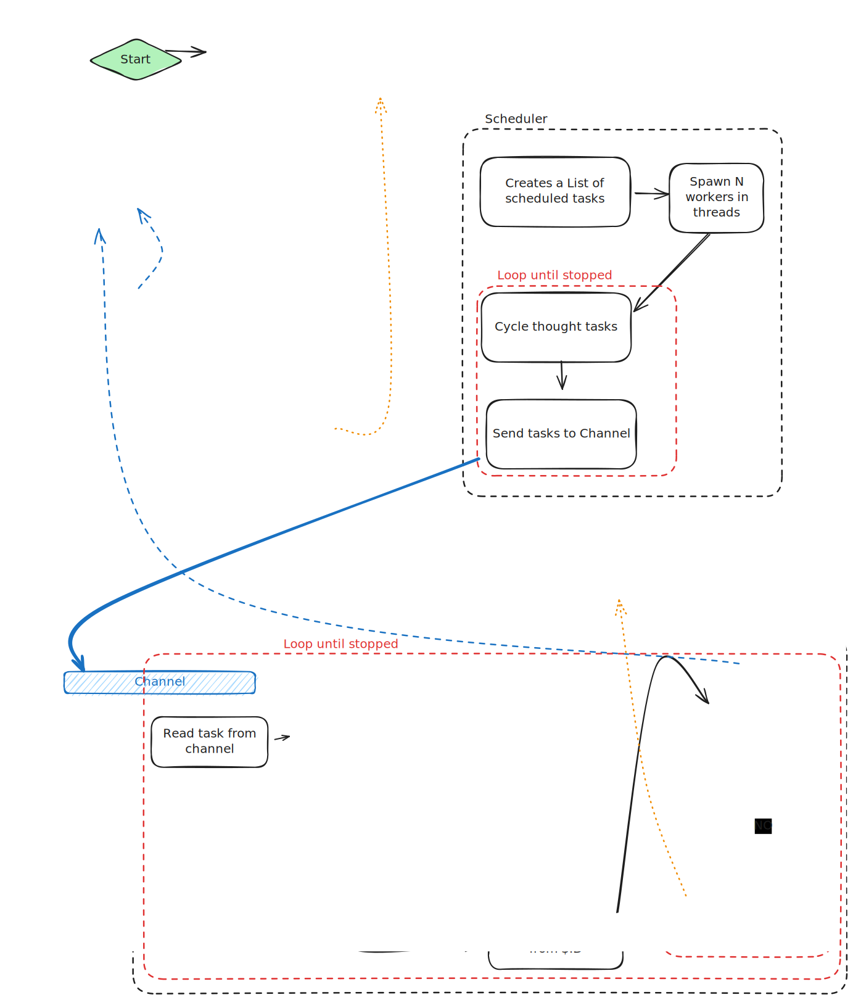

# Mailing Lists Archiver - Track Mailing Lists over NNTP into local files

Collect and archive locally all emails from mailing lists.
This is in active development. It currently supports reading from NNTP endpoints.

This project a few main components:

1. [Archiver](#archiver) : Keep (raw) local copies of emails in from mailing lists
2. [Mailing List Parser](#mailing-list-parser): Parse the raw copies into a Parquet columnar dataset
3. [Anonymizer](#anonymizer): Pseudo-anonymize personal identification from the dataset

# Archiver

## Usage

To compile this program, use the `make build` command. The rust compiler with the `cargo` utility is needed.
If not available, the makefile will use `podman` or `docker` and build the program using the container image for the rust compiler.

The most basic way to run this program, is to provide the NNTP Hostname and port via env variables. `NNTP_HOSTNAME="rcpassos.me" NNTP_PORT=119 cargo run`, or via arguments : `cargo run -H rcpassos.me -p 119` (note: this website is not a NNTP server).
The list of available news groups in the server will be provided for selection.

A config file can be used too (check the Example below).
By default, this program will look for the config file in the current directory.
It will look for archiver_config*.{json,yaml,toml}.

A custom config file path can be passed with the flag `-c`. Ex: `cargo run  -c other_archiver_config.yaml`

```bash
Usage: mlh-archiver [OPTIONS]

Options:
  -c, --config-file <CONFIG_FILE>      [default: archiver_config*]
  -H, --hostname <HOSTNAME>            nntp server domain/ip
  -p, --port <PORT>                    nntp server port [default: 119]
  -o, --output-dir <OUTPUT_DIR>        where results will be stored [default: ./output]
  -n, --nthreads <NTHREADS>            Number of worker threads connecting to different lists [default: 1]
  -l, --loop-groups                    If true, the app will keep running forever. Otherwise, stop after reading all groups
      --group-lists <GROUP_LISTS>      List of groups to be read. "ALL" will select all lists available. Empty value will prompt a selection in the TUI (and save selected values)
      --article-range <ARTICLE_RANGE>  (optional). Read a specific range of articles from the first list provided. Comma separated values, or dash separated ranges, like low-high
  -h, --help                           Print help
```

The `RUST_LOG=debug` variable can be used to increase logging details.

args: `cargo run -- -c offarchiver_config.yaml -H rcpassos.me -p 119`

### Example config file

```yaml
# archiver_config.yaml
hostname: "rcpassos.me"
port: 119
nthreads: 2
output_dir: "./output"
loop-groups: true
group_lists:
  - dev.rcpassos.me.lists.gfs2
  - dev.rcpassos.me.lists.iommu
```

## Implementation

The archiver is implemented in rust, and uses a NNTP library we forked.
It is designed to be a multi-thread* process that can keep the local files up-to-date with the articles (emails) available in the NNTP server.
It is, however, not designed to pull emails as fast as possible, as it could be seen as a malicious or abusive scraping bot.

> *Each thread is able to check one mail-group (mailing list) at a time from the server.
> A thread will only fetch one email at a time.



# Mailing List Parser

Used to parse the output emails from the Archiver into a columnar parquet dataset

## Usage

Run the `make parse` command.
It requires least `podman/podman-compose` or `docker/docker-compose`.

The parsed emails will be saved in a parquet formatted archive (using hive partitioning on the name of the mailing lists) in the `parser_output/parsed/` directory.

Incorrectly parsed email will be `parser_output/<mailing_list>/errors` directory.

# Anonymizer

To pseudo-anonymize the user identification from emails, run `make anonymize`. It expects the base non-anonymized dataset to be in the default `parser_output/parsed` folder, but this can be changed in the compose.yaml file.

This script will replace user identification by SHA1 digests, and produce a more compressed version of the dataset under the `anonymizer_output` folder.

# Example Analysis

There are example analyses that were used during research in the [./analysis](./analysis) folder.
They can be run with `make analysis`. The output will be stored in [./analysis/results/](./analysis/results/) folder.

# Build System

This project provides two ways to run commands: using **Make** or **devbox**.

## Makefile Commands

The root `Makefile` orchestrates all components. Run commands from the project root:

| Command | Description |
|---------|-------------|
| `make` or `make all` | Build and run the archiver |
| `make build` | Build the archiver (Rust) |
| `make run` | Run the archiver |
| `make parse` | Run the mailing list parser |
| `make parse N_PROC=4` | Run parser with 4 parallel processes |
| `make parse LISTS_TO_PARSE="list1,list2"` | Run parser for specific lists only |
| `make parse REDO_FAILED_PARSES=true` | Re-parse only previously failed emails |
| `make anonymize` | Run the anonymizer |
| `make analysis` | Run example analyses |
| `make rebuild` | Rebuild all components |
| `make test` | Run all tests |
| `make test-archiver` | Run archiver tests only |
| `make test-parser` | Run parser tests only |
| `make test-anonymizer` | Run anonymizer tests only |
| `make clean` | Clean all build artifacts |
| `make debug-parser` | Run parser in debug mode |
| `make debug-anonymizer` | Run anonymizer in debug mode |
| `make debug-analysis` | Run analysis in debug mode |

### Prerequisites

- **Archiver**: Requires Rust/Cargo, or Podman/Docker for containerized builds
- **Parser & Anonymizer**: Requires Podman/Podman-compose or Docker/Docker-compose

---

## Setting up Devbox

```bash
devbox shell
```

This will set up the development environment with all required dependencies (Python, uv, Rust, etc.).

### Devbox Commands

[Devbox](https://www.jetify.com/devbox/) is a command-line tool that lets you easily create isolated shells for development. It uses Nix packages to be portable across different systems. See the [installation guide](https://www.jetify.com/docs/devbox/quickstart) to get started.

If using devbox for development environment management, all commands are available as scripts:

| Command | Description |
|---------|-------------|
| `devbox run build` | Build the archiver |
| `devbox run run` | Run the archiver |
| `devbox run parse` | Run the mailing list parser |
| `devbox run anonymize` | Run the anonymizer |
| `devbox run analysis` | Run example analyses |
| `devbox run rebuild` | Rebuild all components |
| `devbox run test` | Run all tests |
| `devbox run test-archiver` | Run archiver tests only |
| `devbox run test-parser` | Run parser tests only |
| `devbox run test-anonymizer` | Run anonymizer tests only |
| `devbox run clean` | Clean all build artifacts |
| `devbox run debug-parser` | Run parser in debug mode |
| `devbox run debug-anonymizer` | Run anonymizer in debug mode |
| `devbox run debug-analysis` | Run analysis in debug mode  |
| `devbox run peek path`|  Quick peek at files |


---
## Scripts

The `scripts/` directory contains utility scripts for working with the parsed data.

### peek-files

Quick inspection tool for Parquet files and directories.

```bash
# Using devbox
devbox run peek <path>

# Using uv directly
uv run scripts/peek_files.py <path>
```

**Features:**

- DataFrame preview (shows first 10 rows)
- Total row count
- Row count per partition (if hive-partitioned)
- Schema display

**Examples:**

```bash
# Inspect a single parquet file
devbox run peek-files parser_output/parsed/list=dev.rcpassos.me.lists.gfs2/list_data.parquet

# Inspect a directory (automatically finds all .parquet files)
devbox run peek-files parser_output/parsed/

# Inspect the raw archiver output
devbox run peek-files ./output/
```

**Sample Output:**

```
devbox run peek ./parser_output 
Inspecting: .../parser_output

Directory: ./parser_output
Found 1 parquet file(s)
--------------------------------------------------

Detected hive partitioning

Partition Statistics:
--------------------------------------------------
  list=org.kernel.vger.linux-iio: 109,954 rows (1 file(s))
--------------------------------------------------
  TOTAL: 109,954 rows across 1 file(s)

Schema (from first file):
  from: String
  to: List(String)
  cc: List(String)
  subject: String
  date: Datetime(time_unit='us', time_zone=None)
  client-date: List(String)
  message-id: String
  in-reply-to: String
  references: List(String)
  x-mailing-list: String
  trailers: List(Struct({'attribution': String, 'identification': String}))
  code: List(String)
  raw_body: String
  __file_name: String

Preview (first 10 rows from first file):
shape: (5, 14)
┌──────────────────────┬───────────────────────────┬───────────────────────────┬───────────────────────────┬───┬───────────────────────────┬───────────────────────────┬───────────────────────────┬─────────────┐
│ from                 ┆ to                        ┆ cc                        ┆ subject                   ┆ … ┆ trailers                  ┆ code                      ┆ raw_body                  ┆ __file_name │
│ ---                  ┆ ---                       ┆ ---                       ┆ ---                       ┆   ┆ ---                       ┆ ---                       ┆ ---                       ┆ ---         │
│ str                  ┆ list[str]                 ┆ list[str]                 ┆ str                       ┆   ┆ list[struct[2]]           ┆ list[str]                 ┆ str                       ┆ str         │
╞══════════════════════╪═══════════════════════════╪═══════════════════════════╪═══════════════════════════╪═══╪═══════════════════════════╪═══════════════════════════╪═══════════════════════════╪═════════════╡
│ "Developer Name"     ┆ ["List of emails          ┆ ["more Emails             ┆ Re: [PATCH] staging       ┆ … ┆ [{"Acked-by","developer   ┆ []                        ┆ On Feb 23 2010,           ┆ 1.eml       │
│ ...                  ┆ ...                       ┆ ...                       ┆ ...                       ┆   ┆ ...                       ┆ ...                       ┆ ...                       ┆             │
└──────────────────────┴───────────────────────────┴───────────────────────────┴───────────────────────────┴───┴───────────────────────────┴───────────────────────────┴───────────────────────────┴─────────────┘
```
